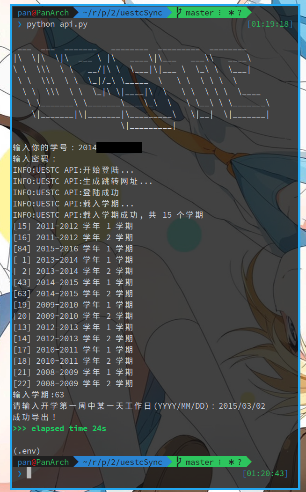

# SyncCourse

旨在方便从电子科技大学（UESTC）的教务系统中导出学生课表

## How to use

首先安装依赖

    pip3 install -r requirements.txt

<del>然后可以用 python3 api.py 使用</del>
教务系统改了，老的用不了，用新的

### 1. 手动保存课表页面 HTML
保存 HTML 到此文件夹下 `raw.html`，注意要用审核元素查看，不能直接复制源码（源码加密了）

### 2. 导出课表

    python manual_api.py

## Sceenshot

